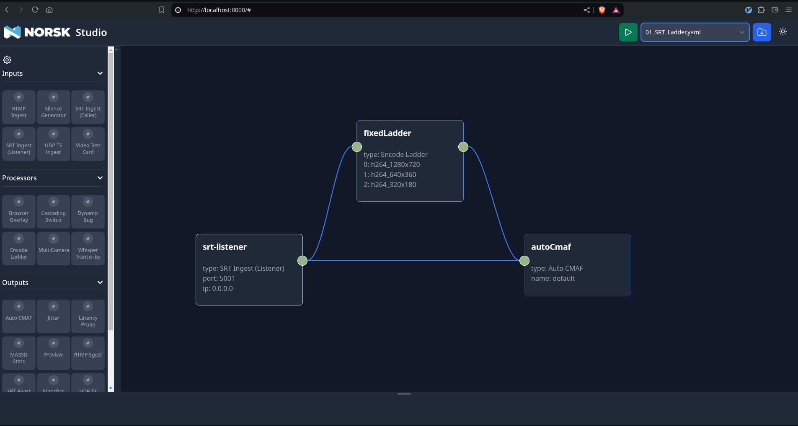
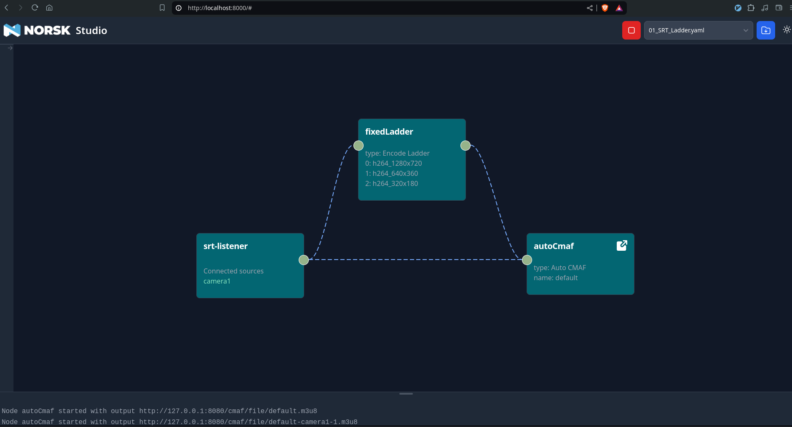

== Norsk Studio Starter Kit

The purpose of this repo is to get you up and running with Norsk Studio as quickly as possible.  It's 3 simple steps away:

* Get a development license
* Clone this repo and copy in your license file
* Run the launch script!

=== Getting a Development License

Using Norsk Media requires a license file, but getting one is really easy.  Just go to XXX, fill in the form and a few seconds later you'll have a license in your inbox.

=== Clone This Repo

[source,bash]
----
git clone https://github.com/norskvideo/norsk-studio-starter-kit.git
cd norsk-studio-starter-kit
----

Now copy your license file into the secrets folder.  It will be something like:

[source,bash]
----
cp ~/Downloads/mySuperSecretLicense.json secrets/license.json
----

=== Run the Launch Script (Docker Compose)

Launching Norsk Studio with Docker compose could not be easier. Just make sure you have the Docker daemon started:

[source,bash]
----
sudo systemctl start docker
----

Then run:

[source,bash]
----
./docker/up.sh
----

This script launches a default instance of Norsk Studio on port 8000 (http://127.0.0.1:8000) with the built-in components and a Norsk media visualizer on port 6791 (http://127.0.0.1:6791). 

If you point your browser to http://127.0.0.1:8000, you should see the Norsk Studio page. There’s an empty workspace in the middle when we just load it, and to the left we have a bunch of nodes that we’ve pre-built. Now, click on the dropdown titled Blank Document on the topright corner and select one of our pre-built workflows - selecting  01_SRT_Ladder.yaml will have the workspace looking like this:



=== Connect to sources

We have an SRT ladder but it doesn't do anything interesting, yet; to make it more interesting, we can send a media source to the SRT listener and watch this media played back. The script below runs an FFmpeg container using Docker to continously stream a video over the SRT protocol.

[source,bash]
----
.docker/sample-srt-source.sh camera1 start
----

Now, when we go back to the studio page and press the play icon, things should see dotted lines appear with the flow moving from the listener to the CMAF output:



You can click on the autoCmaf node to watch the playback of the workflow we just created. And that's it - you now have a workflow that listens for SRT input, encodes the input and provides CMAF output that can be played back from a web player. Congratulations!


We created this demo to show how the entire flow should look like:

image::assets/demo.gif[Demo GIF, link=assets/demo.gif]

And when you are done, you can run

[source,bash]
----
./docker/down.sh
----
to shut everything down for you again. 

Not running locally?  You might want to run

=== Whats in the Starter Kit

[source,bash]
----
mnt
├── data
│  ├── bugs
│  │  └── trinorsk.png
│  ├── overrides
│  │  └── example-overrides.yaml
│  ├── studio-save-files
│  │  ├── OverlayBug.yaml
│  │  ├── SourceSwitcher.yaml
│  │  ├── SourceSwitcherNoPreview.yaml
│  │  ├── VisionDirector.yaml
│  │  ├── VisionDirector2.yaml
│  │  └── WhisperTranscribe.yaml
----


=== Example Save File

=== Example Sources


=== Directory Structure


=== Configuration and Tweaks

=== Local Development


== Runtime Environments

Norsk is a great example of the power and flexibility that containerised software brings.  It runs brilliantly in the cloud and is easy to launch in any of the major cloud providers.

It runs brilliantly in on-prem deployments.  If you have been following this guide, you've already seen how easy it is to launch on you own server.  Great as cloud technology is, there are times when running on your own hardware makes sense.  Norsk supports a wide range of hardware acceleration platforms, not all of which are (yet) easily available in the cloud.  Norsk supports a wide range of input and output standards - not all of which are practical in the cloud (SDI being a great example).

It runs brilliantly embedded.  Norsk makes for a great on-site encoder.  Its richness of capability means that you can meet even challenging workflow requirements right at your live event.  Direct hand off to an ultra-low latency CDN direct from your encoder?  No problem!  Local recording?  DRM? Subtitling? No problem!

It runs brilliantly in hybrid environments.  Maybe the right thing for you is to meet core demand with an on-prem offering (perhaps leveraging for energy efficient hardware).  One challenge with a purely on-prem approach is that you can only scale as far as your hardware allows.  Norsk makes it easy to go beyond that, scaling out to the cloud to meet peak load or for DR purposes.

In short, Norsk makes it easy to choose where any aspect of your media workflow should run and even to change that on a case by case basis.  It enables the technology to do what's right for your business, rather than the other way round.


=== Kubernetes

One very common deployment technology often used in Norsk deployments is Kubernetes.  The Kubernetes ecosystem is huge and there are lots and lots of tools for managing Kubernetes deployments, configuring pods, networks etc.

This starter-kit comes with a simple example of how you can launch a Norsk Studio deployment with Kubernetes (TLDR; `./kubernetes/create.sh` and `./kubernetes/destroy.sh` do what you think they do!)

You might want to visit `./kubernetes/env/kubectl-command` first if you are using a local Kubernetes development environment such as Minikube or MicroK8s.

Simple example - not meant to be any sort of template

=== Norsk Manager

Norsk Manager is another excellent option for Norsk Media deployments.

Amazing as the likes of Kubernetes are, they solve a very wide-ranging problem and are necessarily complex as a result.  If you already have a sophisticated container management setup then the good news is that Norsk fits seamlessly into that world.

If you are looking for something more tailored to the specific challenge of live media workflows, then Norsk Manager is probably what you want.

It is to infrastructure management what Norsk Media is to media workflows.  It takes care of the undifferentiated heavy lifting: exactly how you create or monitor a new server in region XYZ; how you commission a particular channel or event to a server; how to react in the face of infrastrucutre failures.  This allows you to focus on what matters - your business process and your customers'  user experience.

We are working on a starter kit for Norsk Manager as well, so going from zero to a fully working managed cloud deployment should take a matter of minutes.

== Local Development

Norsk Studio is an open and extensible application.  For many use-cases it will do exactly what you want out of the box, but a key aspect of Norsk Studio is ease of extensibility.  This Starter Kit includes everything you need to build and run your own custom containers.

 core tenet of the application is  Building new components is an important


# Dev
```
npm install
npm run build
npm run server
```

# Deploy

```
npm run release
```

stop the existing code if running
- /opt/gl/id3as-norsk-studio-starter-kit/deploy
- ./stop.sh

- Scp that up to the server (/opt/gl/id3as-norsk-studio-starter-kit/)
- rm -rf deploy
- Untar it
- cd deploy
- docker load < norsk-studio-starter-kit.tar
- ./run.sh sm


